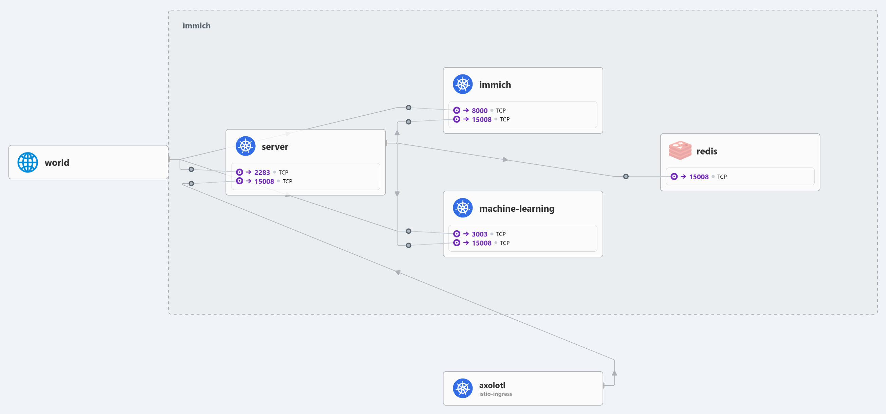
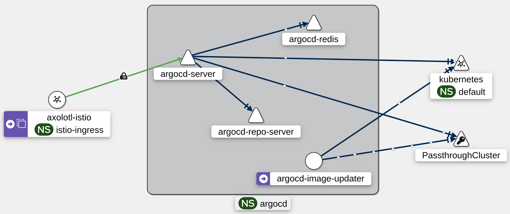

# Networking

## Cilium

In-cluster networking is set up with [Cilium](https://cilium.io) for CNI, kube-proxy replacement, and route advertisements via BGP. Cilium sets up its [datapath with eBPF](https://docs.cilium.io/en/stable/network/ebpf/intro/), rather than the more traditional method of configuring iptables, resulting in better performance and observability.

### Route Advertisements

When a [Kubernetes service of type `LoadBalancer`](https://kubernetes.io/docs/concepts/services-networking/service/#loadbalancer) is created, a cloud controller needs to assign the pending service an IP address and route traffic to it. In our case, Cilium is our cloud controller which assigns the pending `LoadBalancer` service an IP address from a given address pool. It then advertises that address to our peered router via BGP so that the router knows to route traffic from the assigned IP address to the corresponding nodes.

### Hubble

[Hubble](https://github.com/cilium/hubble) is a fully distributed networking and security observability platform built on top of Cilium and eBPF to enable deep visibility into the communication and behavior of services.

## Istio

[Istio](https://istio.io) is a secure, powerful, and extensible service mesh.

It provides:[^1]

- Secure service-to-service communication in a cluster with mutual TLS encryption, strong identity-based authentication and authorization
- Automatic load balancing for HTTP, gRPC, WebSocket, and TCP traffic
- Fine-grained control of traffic behavior with rich routing rules, retries, failovers, and fault injection
- A pluggable policy layer and configuration API supporting access controls, rate limits and quotas
- Automatic metrics, logs, and traces for all traffic within a cluster, including cluster ingress and egress

In our case, we have Istio set up in ambient mode, as we do not currently have any need for the `EnvoyFilter` API, which is only supported in sidecar mode. Additionally, ambient mode is significantly more resource efficient compared to sidecar mode. Sidecar mode deploys an L7 proxy sidecar for every pod in the service mesh, while ambient mode only deploys an L4 proxy per node with optional L7 proxies for a service when necessary.

### Gateway API

We use the Kubernetes standard, [Gateway API](https://gateway-api.sigs.k8s.io/), to configure our Istio service mesh for north/south and east/west traffic.

### Kiali

[Kiali](https://kiali.io) allows us to configure, visualize, validate, and troubleshoot our service mesh. Below is a graph of Argo CD traffic from Kiali.

We do not, however, use Kiali to configure our service mesh, as we store all configuration declaratively in a git repository so that we can perform GitOps[^2].

[^1]: Bullet points were quoted from Istio documentation [here](https://istio.io/latest/docs/overview/what-is-istio/).

[^2]: Learn more about GitOps [here](./gitops.md).
