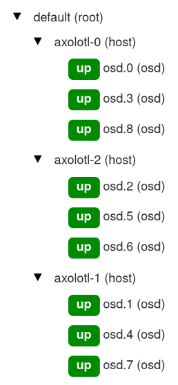

# Storage

## Rook Ceph

As mentioned previously, we run a hyperconverged Kubernetes cluster, meaning that both compute and storage are on each of the 3 nodes. [Ceph](https://ceph.io/) is the distributed storage solution deployed and it is all orchestrated by [Rook](https://rook.io). Rook makes it much easier to deploy and manage a Ceph cluster on Kubernetes.

Each of the 3 nodes in this cluster contains 3x 8TB HDDs that are all dedicated for the Ceph cluster. This means that there is a total of 72TB of storage, but only 24TB is usable, as all of our storage pools have triple replication to ensure data durability. In the future, we may look into partitioning storage pools into hot/cold, so that we can use erasure coding instead of replication for cold storage. Erasure coding is much more storage efficient, but incurs much higher compute cost for encoding/decoding data.

<figure markdown="span">
    
</figure>

With failure domain set to `host`, we are able to survive a 1-node failure with no issues and a 2-node failure with writes disrupted (but no data loss). At least 2 healthy nodes are necessary to maintain quorum, so if there is only 1 healthy node, the cluster loses quorum and writes are disabled until quorum is re-established.

### Public Telemetry Dashboard

Check out this awesome dashboard on Ceph usage: https://telemetry-public.ceph.com/
